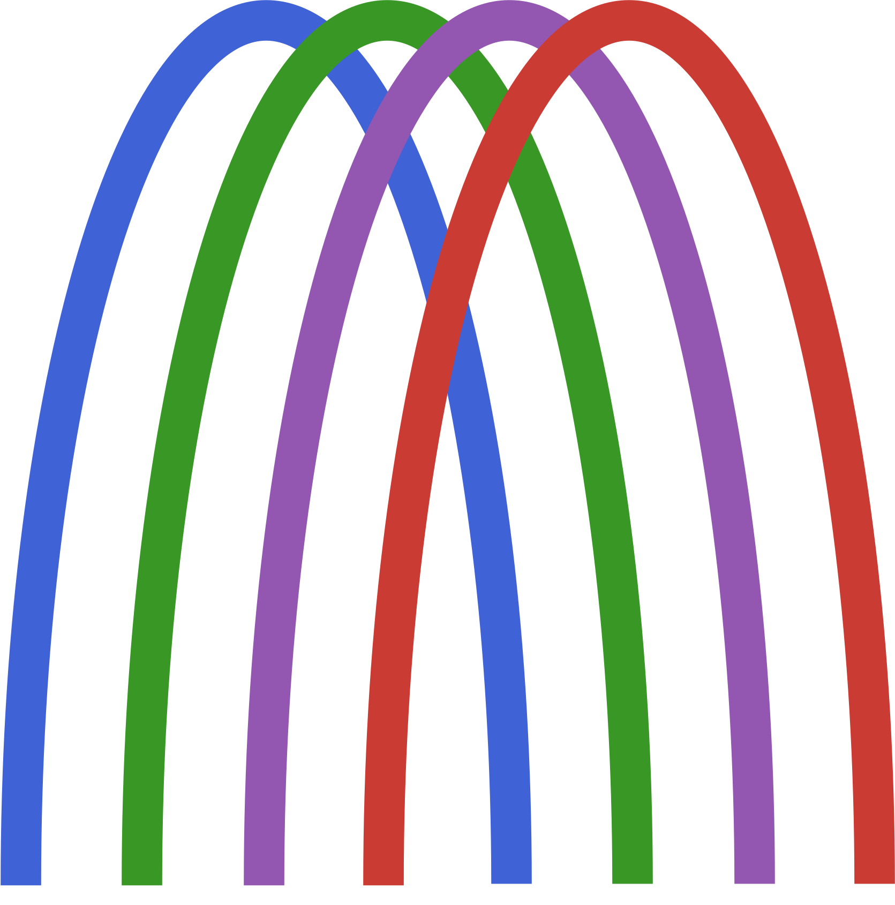

# ProRF.jl 
`ProRF` provides a full process for applying the random forest model of protein sequences using `DecisionTree`.

## Install
<!-- You must install Python module `Bokeh`, `Matplotlib` before add `ProRF`. For more information, see `PyCall` [main page](https://github.com/JuliaPy/PyCall.jl). -->
```julia
using Pkg
Pkg.add(url="https://github.com/Chemical118/ProRF.jl")
```

## Documentaion
[ProRF.jl Documentaion](https://chemical118.github.io/ProRF.jl/dev/)  
  
`ProRF` is still developing! Please send to <wowo0118@korea.ac.kr> if you have any question.

<!-- ## Package
This is an environment where you can run `ProRF` perfectly with VSCode.
```bash
$ docker pull ghcr.io/chemical118/prorf:latest
``` -->